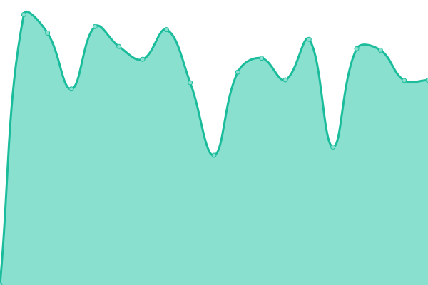
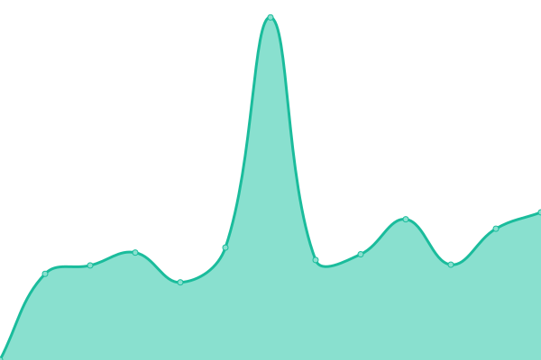
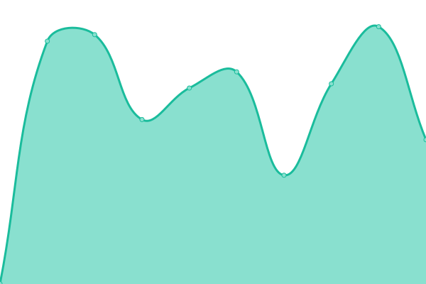
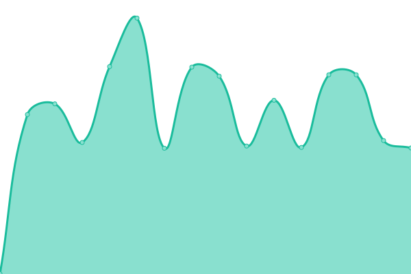

# [📈 Live Status](https://status.adcmnetworks.co.uk): <!--live status--> **🟥 Complete outage**

This repository contains the open-source uptime monitor and status page for [Alexander Lyall](https://status.adcmnetworks.co.uk), powered by [Upptime](https://github.com/upptime/upptime).

With [Upptime](https://upptime.js.org), you can get your own unlimited and free uptime monitor and status page, powered entirely by a GitHub repository. We use [Issues](https://github.com/MrLyallCSIT/adcm-network-status/issues) as incident reports, [Actions](https://github.com/MrLyallCSIT/adcm-network-status/actions) as uptime monitors, and [Pages](https://status.adcmnetworks.co.uk) for the status page.

<!--start: status pages-->
<!-- This summary is generated by Upptime (https://github.com/upptime/upptime) -->
<!-- Do not edit this manually, your changes will be overwritten -->
<!-- prettier-ignore -->
| URL | Status | History | Response Time | Uptime |
| --- | ------ | ------- | ------------- | ------ |
|  Network Cloud Gateway | 🟥 Down | [network-cloud-gateway.yml](https://github.com/MrLyallCSIT/adcm-network-status/commits/HEAD/history/network-cloud-gateway.yml) | 

 0ms
     
 | 

<a href="https://status.adcmnetworks.co.uk/history/network-cloud-gateway">0.00%</a>
    

|  [Computing:Box](https://www.computingbox.co.uk/) | 🟥 Down | [computing-box.yml](https://github.com/MrLyallCSIT/adcm-network-status/commits/HEAD/history/computing-box.yml) | 

 777ms
     
 | 

<a href="https://status.adcmnetworks.co.uk/history/computing-box">89.07%</a>
    

|  [Keresley Church](https://www.keresley.church/) | 🟥 Down | [keresley-church.yml](https://github.com/MrLyallCSIT/adcm-network-status/commits/HEAD/history/keresley-church.yml) | 

 2056ms
     
 | 

<a href="https://status.adcmnetworks.co.uk/history/keresley-church">90.95%</a>
    

|  [Keresley Church Beta Site](https://beta.keresley.church/) | 🟥 Down | [keresley-church-beta-site.yml](https://github.com/MrLyallCSIT/adcm-network-status/commits/HEAD/history/keresley-church-beta-site.yml) | 

 706ms
     
 | 

<a href="https://status.adcmnetworks.co.uk/history/keresley-church-beta-site">90.68%</a>
    

|  [Mottashaw Consulting](https://www.mottashaw.co.uk/) | 🟥 Down | [mottashaw-consulting.yml](https://github.com/MrLyallCSIT/adcm-network-status/commits/HEAD/history/mottashaw-consulting.yml) | 

 628ms
     
 | 

<a href="https://status.adcmnetworks.co.uk/history/mottashaw-consulting">92.08%</a>
    

|  Poseidon IPv4 | 🟥 Down | [poseidon-i-pv4.yml](https://github.com/MrLyallCSIT/adcm-network-status/commits/HEAD/history/poseidon-i-pv4.yml) | 

 0ms
     
 | 

<a href="https://status.adcmnetworks.co.uk/history/poseidon-i-pv4">0.00%</a>
    

|  Poseidon IPv6 | 🟥 Down | [poseidon-i-pv6.yml](https://github.com/MrLyallCSIT/adcm-network-status/commits/HEAD/history/poseidon-i-pv6.yml) | 

 0ms
     
 | 

<a href="https://status.adcmnetworks.co.uk/history/poseidon-i-pv6">0.00%</a>
    

<!--end: status pages-->

[**Visit our status website →**](https://status.adcmnetworks.co.uk)

## 📄 License

- Powered by: [Upptime](https://github.com/upptime/upptime)
- Code: [MIT](./LICENSE) © [Anand Chowdhary](https://anandchowdhary.com), supported by [Pabio](https://pabio.com)
- Data in the `./history` directory: [Open Database License](https://opendatacommons.org/licenses/odbl/1-0/)
